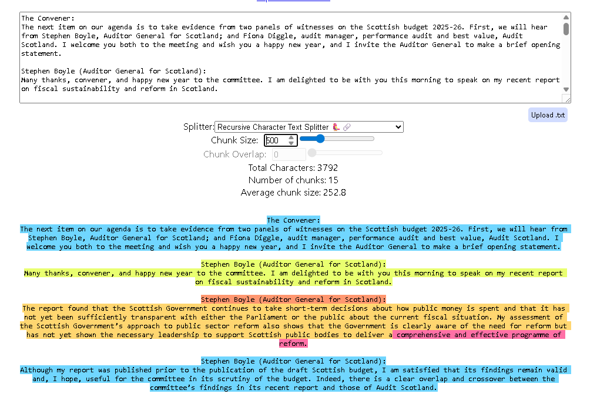

# Parliamentary Meeting Minutes Conversational Agent

## Executive Summary

This project delivers an advanced, production-ready RAG (Retrieval-Augmented Generation) system designed to provide grounded, hallucination-free insights from Scottish Parliamentary records.

The architecture transitioned from a high-efficiency **Base Implementation** to a high-precision **Enhanced Production Architecture**. By implementing a **Hybrid-Rerank** strategy and **Multi-turn Contextualization**, the system achieved a **25% gain in Faithfulness** and nearly **perfect Context Precision (0.98)** on complex, multi-document queries.

---

## Technical Architecture & Design Decisions

### 1. Base Implementation (The Efficiency Baseline)

This phase focused on establishing a fast, reliable baseline for semantic search.

* **Embedding Model**: `intfloat/e5-small-v2`
* **Node Parser**: `SentenceSplitter`
* **Chunk Configuration**: 400 characters with 100-character overlap.
* **Retriever**: Standard Vector-based semantic search.

**Rationale & Engineering Choices:**
I used **intfloat/e5-small-v2** because it gives a strong quality-to-speed trade-off for semantic retrieval. On the MTEB benchmark (a widely used “leaderboard” that tests how well embedding models retrieve relevant text across many datasets), e5-small-v2 performs very competitively for its size. That means I get high retrieval accuracy without paying the cost of heavier models (slower inference and larger memory use).

For chunking, I used SentenceSplitter with 400 characters and 100 overlap as a practical baseline. This configuration delivered fast retrieval and low latency, and it generally returned grounded (source-backed) answers. However, it sometimes lacked completeness for multi-turn discussions because the fixed character-based splits could cut through a conversation at uneven points, causing key speaker turns or surrounding context to fall into adjacent chunks and be missed during retrieval.

---

### 2. Enhanced Version (The Production Approach)

This phase optimized for the specific "nuances" of parliamentary data: speaker interruptions, legal terminology, and cross-document reasoning.

* **Hybrid Retriever**: Interleaved BM25 (Keyword) + Vector (Semantic) search.
* **Embedding Upgrade**: `text-embedding-3-small` (1536-dimensions).
* **Recursive Chunking**: `SentenceSplitter` with 500-token size and 120-token overlap.
* **Reranker**: `RankGPTRerank` (Top-5 optimization).
* **Contextual Memory**: `CondensePlusContextChatEngine` with `ChatMemoryBuffer`.

**Rationale & Engineering Choices:**
Parliamentary minutes behave differently from normal documents: they are dialogue-heavy, filled with named people/organisations, and contain domain-specific terms that users often ask about verbatim. For example, questions may include exact entities like “Audit Scotland”, “Professor David Heald”, or phrases like “Barnett consequentials” and “ScotWind”. In this setting, relying on vector search alone can miss the best evidence because semantic similarity may rank a “related” chunk above the chunk that contains the exact term the user asked for.

To fix this, I implemented Hybrid Retrieval (BM25 + Vector) using an interleaving strategy:
* BM25 ensures keyword-heavy queries retrieve the exact mentions (e.g., a chunk that literally contains “Barnett consequentials”).
* Vector search retrieves paraphrases and semantically related evidence (e.g., a chunk that discusses the same funding concept without using the exact phrase).
Interleaving gives the best of both: higher Hit Rate for keyword queries and better recall for semantically phrased questions.

I also upgraded the embeddings to **text-embedding-3-small** to improve retrieval ranking quality on harder cases, especially when the question is not a direct keyword match (e.g., “What was the argument for removing the no-compulsory-redundancy policy?”). The higher-capacity embedding space helps pull the most relevant conversational evidence closer to the top of the results list, improving MRR and reducing the need to increase top_k aggressively.

I chose a 500-token chunk size to better preserve full conversation turns (e.g., a question, the response, and the follow-up often appear across multiple speaker lines). To validate the chunk boundaries visually, I used ChunkViz `(https://chunkviz.up.railway.app/)`. In the `ChunkViz view`, the highlighted spans showed that a max ~500-token window most consistently captured the complete exchange in a single chunk, instead of splitting key speaker turns across multiple chunks. Please see the image down below.

To support follow-up questions like `What did he say next?` or `Who disagreed with that point?`, I used **CondensePlusContextChatEngine** with **ChatMemoryBuffer**. This allows the system to resolve references like he/who/that point by carrying forward the conversational state and rewriting the user query into a standalone question that retrieval can answer reliably. Finally, I added RankGPTRerank to improve the ordering of retrieved chunks. Finally, I used the gptranker to rank the chunks and retrieved top 5.


<p align="center">
  
</p>
---

## Evaluation & Performance Metrics

I evaluated the system using **three difficulty tiers** of datasets to measure both retrieval quality and generation grounding.

### Evaluation Datasets (Location + Versions)

All evaluation datasets live in:

* `evaluation/dataset/`

I maintained **three versions**:

1. **Basic Dataset (retriever-only sanity checks)**

   * File: `evaluation/dataset/BASIC_rag_eval_dataset.json`
   * Purpose: Direct questions that should be answerable from **single chunks** / straightforward retrieval.

2. **Hard Golden Dataset (realistic RAG testing)**

   * File: `evaluation/dataset/HARD_parliament_rag_golden_dataset.json`
   * Purpose: **~30 curated Q/A pairs** including:

     * single-file + cross-file questions
     * medium → complex reasoning
     * human-in-the-loop refinement (LLM-assisted but manually tightened)

3. **Extremely Hard Golden Dataset (multi-file synthesis + coreference)**

   * File: `evaluation/dataset/EXTREME_complex_top_10_golden_dataset.json`
   * Purpose: **10 advanced questions** requiring:

     * evidence across **multiple meetings files**
     * higher risk of “topic overlap” (similar terms across dates)
     * questions required the grounded answers.

---

### Metrics Used

* **Retriever metrics:** Hit Rate, MRR
* **RAGAS metrics:** Faithfulness, Context Precision, Context Recall

---
### Baseline vs. Production Results (Hard Dataset)

| Metric | Base (Vector Only) | **Enhanced (Production)** | Improvement |
| --- | --- | --- | --- |
| **Faithfulness** | 0.7185 | **0.8959** | +24.7% |
| **Context Precision** | 0.7530 | **0.9182** | +21.9% |
| **Context Recall** | 0.6994 | **0.8512** | +21.7% |

### Reports of the A/B testing

* **BASIC (Retriever Metrics) — Base (V1)** Report: `evaluation/results/Basic_run_with_Sentence_Splitter_V1_BASIC.md`

* **HARD (RAGAS) — Base (V1)** Report: `evaluation/results/Golden_Dataset_Evaluation_V1_HARD.md`

* **EXTREME HARD (RAGAS) — Base (V1)** Report: `evaluation/results/Golden_Dataset_Evaluation_V1_EXTREME_HARD.md`

* **BASIC (Retriever Metrics) — Enhanced (V2)** Report: `evaluation/results/Basic_run_with_Sentence_Splitter_V2_BASIC.md`

* **HARD (RAGAS) — Enhanced (V2)** Report: `evaluation/results/Golden_Dataset_Evaluation_V2_HARD.md`

* **EXTREME HARD (RAGAS) — Enhanced (V2)** Report: `evaluation/results/Golden_Dataset_Evaluation_V2_EXTREME_HARD.md`

V2 shows a big improvement in answer quality on the Hard dataset: it is more grounded (faithfulness 0.8959) and retrieves cleaner + more complete context (precision 0.9182, recall 0.8512), so answers are usually correct and well-supported. On the Extreme Hard dataset, V2 achieves very high precision (0.9800), meaning it almost always selects the most relevant evidence with minimal noise, which helps reduce hallucinations.

---

## Getting Started

### 1. Prerequisites

Create a `.env` file with your `OPENAI_API_KEY`. Configuration parameters for chunking, models, and paths are managed centrally in `params.yaml`.

### 2. Run with Docker

```bash
# Start Qdrant and the API service
docker compose build --no-cache

```

### 3. Run Evaluations & Tests

```bash
# Unit tests for API and Agent
pytest tests/test_api.py -v

# Run Retriever Evaluation (Hit Rate/MRR)
python evaluation/scripts/evaluate_retriever.py

# Run RAGAS Golden Dataset Evaluation
python evaluation/scripts/evaluate_golden_dataset.py


```
### 4. Local Run
```bash
python main.py
```

### Cost summary (including total)

The cost is mainly **LLM tokens × model price** across: **Condense → (optional) query embedding → GPT rerank → Final answer**

**Prices (Standard tier):**

* **gpt-4o-mini**: $0.15 / 1M input tokens, $0.60 / 1M output tokens.
* **gpt-4.1-mini (judge/eval)**: $0.40 / 1M input, $1.60 / 1M output.
* **text-embedding-3-small**: $0.02 / 1M tokens.

**Cost formulas:**

* `gpt-4o-mini cost = (Tin*0.15 + Tout*0.60) / 1,000,000`
* `gpt-4.1-mini cost = (Tin*0.40 + Tout*1.60) / 1,000,000`
* `embedding cost = (Tembed*0.02) / 1,000,000`

---

### Example totals (using your earlier token estimate)

Assume per query:

* Condense: **500 in / 80 out**
* Embed: **60 tokens**
* Rerank (16 chunks): **5200 in / 150 out**
* Answer: **1800 in / 350 out**
* Judge (eval only): **900 in / 250 out**

✅ **Total runtime cost (no judge)** ≈ **$0.00147 per query**


